# Awesome MuJoCo Robots 

A curated catalog of **70 ready-to-run robots** for [MuJoCo](https://mujoco.org), vendored from [MuJoCo Menagerie](https://github.com/google-deepmind/mujoco_menagerie) and re-hosted with an in-browser viewer.

Each directory in [`catalog/`](.) is self-contained: meshes in `assets/`, the scene file, plus its own `README.md` and `LICENSE`. Category, display name, DoF count and license track upstream.

## Contents

* [Humanoids](#humanoids) — 11
* [Quadrupeds](#quadrupeds) — 8
* [Bipeds](#bipeds) — 1
* [Biomechanical](#biomechanical) — 3
* [Dual Arms](#dual-arms) — 1
* [Mobile Manipulators](#mobile-manipulators) — 7
* [Drones](#drones) — 2
* [Arms](#arms) — 24
* [End-effectors](#end-effectors) — 11
* [Mobile Bases](#mobile-bases) — 1
* [Miscellaneous](#miscellaneous) — 1
* [Adding a Robot](#adding-a-robot)
* [License](#license)

## Models

> Click any thumbnail below to open the model in an in-browser MuJoCo viewer powered by [megahady.github.io/Robot_Lab](https://megahady.github.io/Robot_Lab/).

<!-- BEGIN MODELS (auto-generated — do not edit) -->

**Humanoids.**

| Preview | Name | DoFs | License |
|:---:|---|---|---|
|  | Unitree H1 | 19 | [BSD-3-Clause](unitree_h1/LICENSE) |
|  | Robotis OP3 | 20 | [Apache-2.0](robotis_op3/LICENSE) |
| <a href='https://megahady.github.io/Robot_Lab/?model=catalog/unitree_g1/scene.xml' title='Open live preview for Unitree G1'>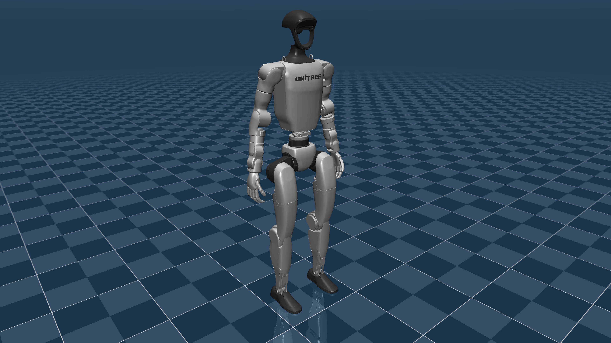</a> | Unitree G1 | 29 | [BSD-3-Clause](unitree_g1/LICENSE) |
|  | TALOS | 44 | [Apache-2.0](pal_talos/LICENSE) |
|  | Booster T1 | 23 | [Apache-2.0](booster_t1/LICENSE) |
| <a href='https://megahady.github.io/Robot_Lab/?model=catalog/toddlerbot_2xc/scene.xml' title='Open live preview for ToddlerBot 2XC'>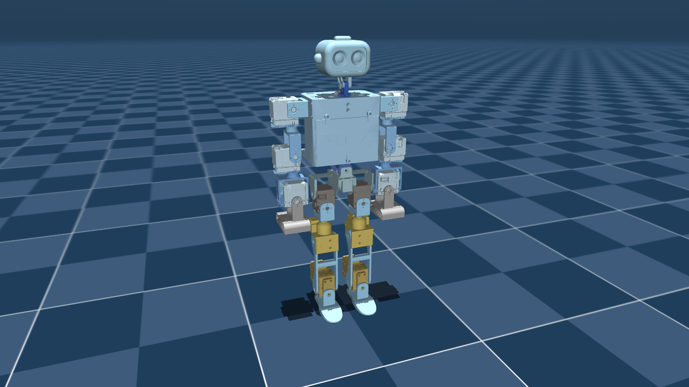</a> | ToddlerBot 2XC | 44 | [MIT](toddlerbot_2xc/LICENSE) |
|  | PNDbotics Adam_lite | 25 | [MIT](pndbotics_adam_lite/LICENSE) |
|  | Apptronik Apollo | 32 | [Apache-2.0](apptronik_apollo/LICENSE) |
|  | Berkeley Humanoid | 12 | [BSD-3-Clause](berkeley_humanoid/LICENSE) |
|  | Fourier N1 | 23 | [Apache-2.0](fourier_n1/LICENSE) |
|  | ToddlerBot 2XM | 44 | [MIT](toddlerbot_2xm/LICENSE) |

**Quadrupeds.**

| Preview | Name | DoFs | License |
|:---:|---|---|---|
| <a href='https://megahady.github.io/Robot_Lab/?model=catalog/unitree_a1/scene.xml' title='Open live preview for Unitree A1'>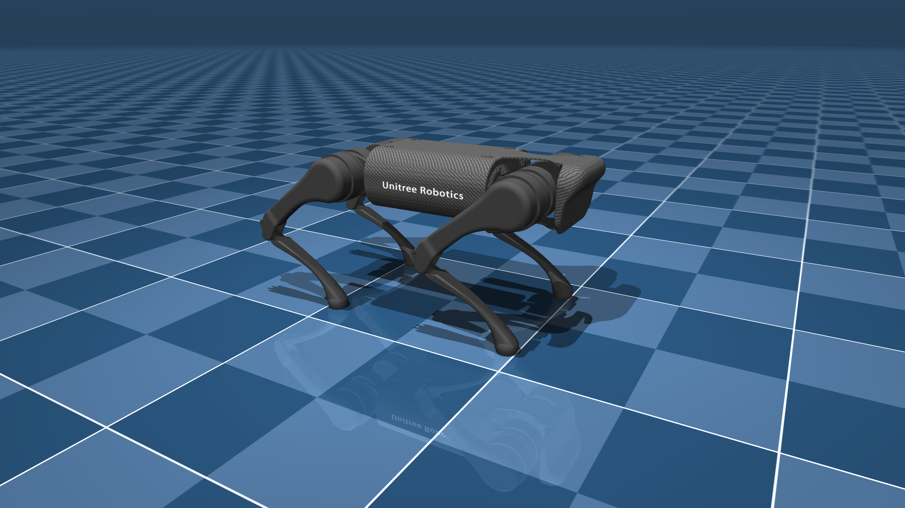</a> | Unitree A1 | 12 | [BSD-3-Clause](unitree_a1/LICENSE) |
| <a href='https://megahady.github.io/Robot_Lab/?model=catalog/google_barkour_v0/scene.xml' title='Open live preview for Google Barkour v0'>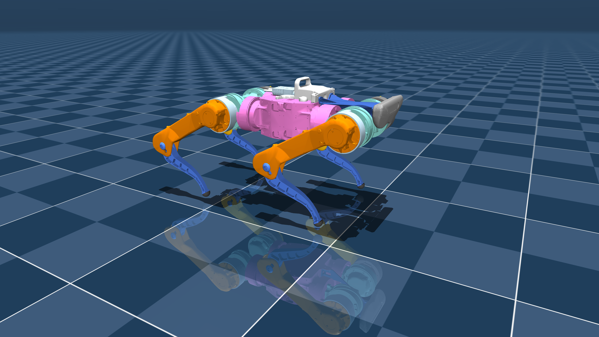</a> | Google Barkour v0 | 12 | [Apache-2.0](google_barkour_v0/LICENSE) |
| <a href='https://megahady.github.io/Robot_Lab/?model=catalog/anybotics_anymal_b/scene.xml' title='Open live preview for ANYmal B'>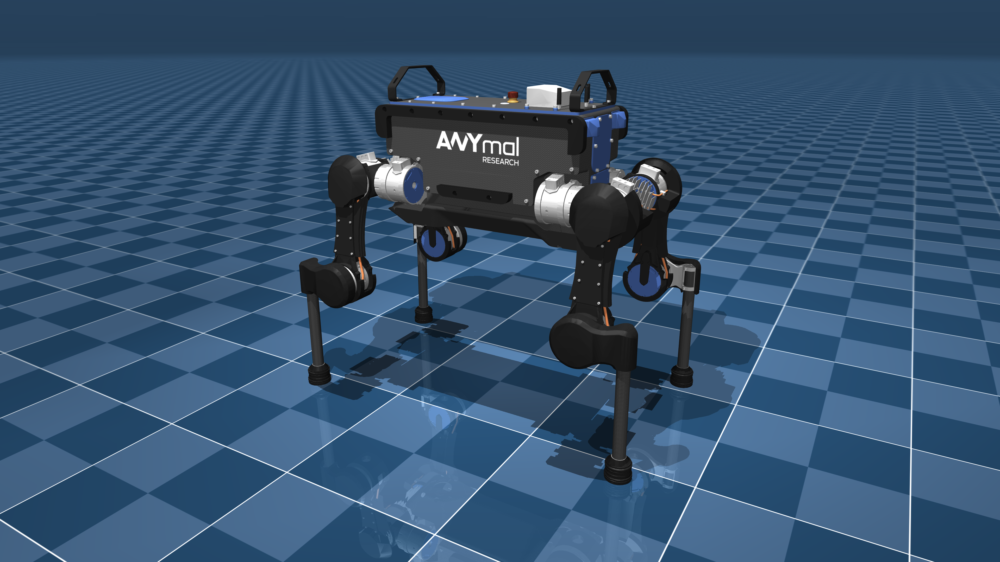</a> | ANYmal B | 12 | [BSD-3-Clause](anybotics_anymal_b/LICENSE) |
|  | Unitree Go1 | 12 | [BSD-3-Clause](unitree_go1/LICENSE) |
|  | ANYmal C | 12 | [BSD-3-Clause](anybotics_anymal_c/LICENSE) |
| <a href='https://megahady.github.io/Robot_Lab/?model=catalog/google_barkour_vb/scene.xml' title='Open live preview for Google Barkour vB'>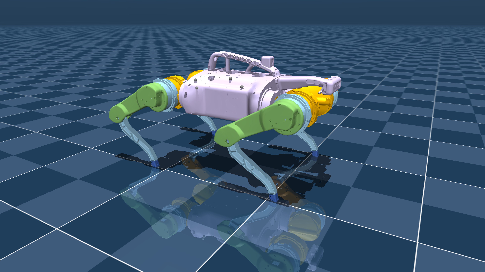</a> | Google Barkour vB | 12 | [Apache-2.0](google_barkour_vb/LICENSE) |
|  | Unitree Go2 | 12 | [BSD-3-Clause](unitree_go2/LICENSE) |
|  | Boston Dynamics Spot | 19 | [BSD-3-Clause](boston_dynamics_spot/LICENSE) |

**Bipeds.**

| Preview | Name | DoFs | License |
|:---:|---|---|---|
|  | Agility Cassie | 28 | [MIT](agility_cassie/LICENSE) |

**Biomechanical.**

| Preview | Name | DoFs | License |
|:---:|---|---|---|
| <a href='https://megahady.github.io/Robot_Lab/?model=catalog/flybody/scene.xml' title='Open live preview for Flybody'>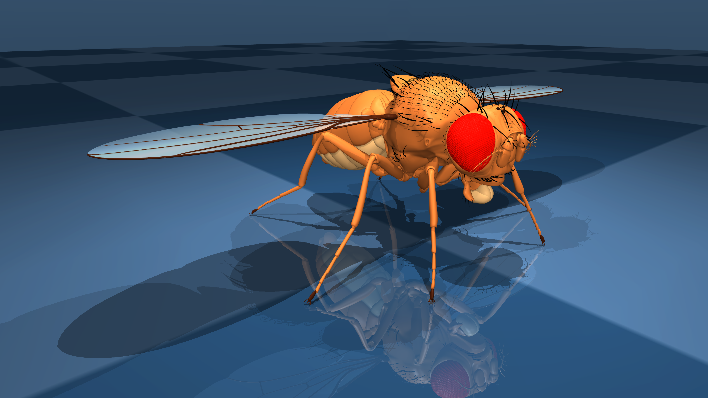</a> | Flybody | 102 | [Apache-2.0](flybody/LICENSE) |
|  | IIT SoftFoot | 92 | [BSD-3-Clause](iit_softfoot/LICENSE) |
|  | MS-Human-700 | 85 | [Apache-2.0](ms_human_700/LICENSE) |

**Dual Arms.**

| Preview | Name | DoFs | License |
|:---:|---|---|---|
| <a href='https://megahady.github.io/Robot_Lab/?model=catalog/aloha/scene.xml' title='Open live preview for ALOHA'>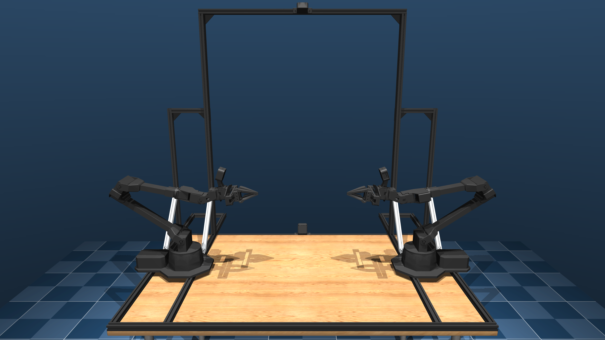</a> | ALOHA | 16 | [BSD-3-Clause](aloha/LICENSE) |

**Mobile Manipulators.**

| Preview | Name | DoFs | License |
|:---:|---|---|---|
| <a href='https://megahady.github.io/Robot_Lab/?model=catalog/google_robot/scene.xml' title='Open live preview for Google Robot'>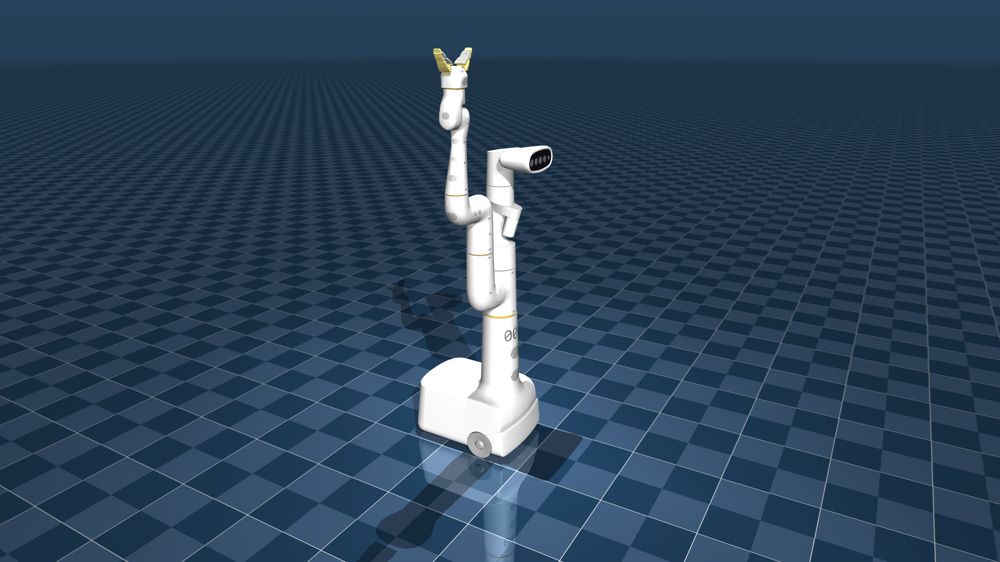</a> | Google Robot | 9 | [Apache-2.0](google_robot/LICENSE) |
|  | Hello Robot Stretch 2 | 17 | [BSD-3-Clause-Clear](hello_robot_stretch/LICENSE) |
|  | Stanford TidyBot | 18 | [MIT](stanford_tidybot/LICENSE) |
|  | Hello Robot Stretch 3 | 20 | [Apache-2.0](hello_robot_stretch_3/LICENSE) |
| <a href='https://megahady.github.io/Robot_Lab/?model=catalog/pal_tiago/scene_position.xml' title='Open live preview for TIAGo'>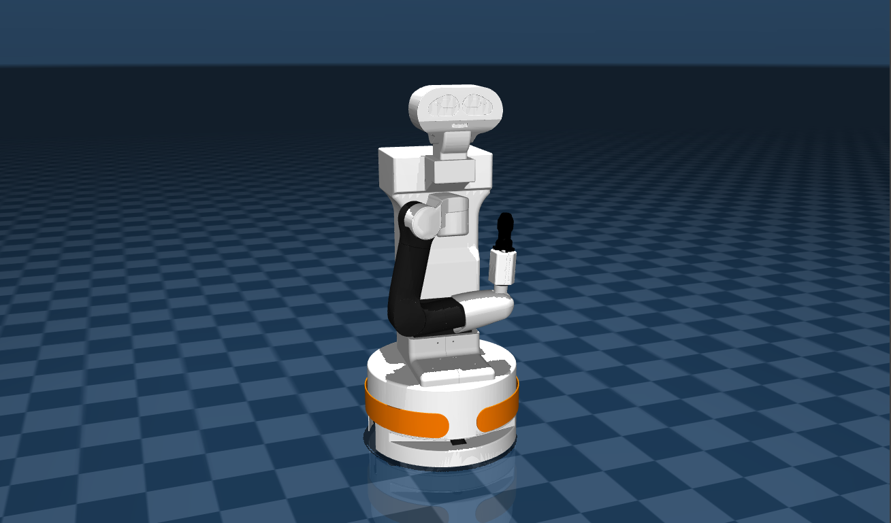</a> | TIAGo | 22 | [Apache-2.0](pal_tiago/LICENSE) |
|  | TIAGo++ | 25 | [Apache-2.0](pal_tiago_dual/LICENSE) |
|  | Rainbow Robotics RBY1 | 28 | [Apache-2.0](rainbow_robotics_rby1/LICENSE) |

**Drones.**

| Preview | Name | DoFs | License |
|:---:|---|---|---|
|  | Skydio X2 | 0 | [Apache-2.0](skydio_x2/LICENSE) |
| <a href='https://megahady.github.io/Robot_Lab/?model=catalog/bitcraze_crazyflie_2/scene.xml' title='Open live preview for Bitcraze Crazyflie 2'>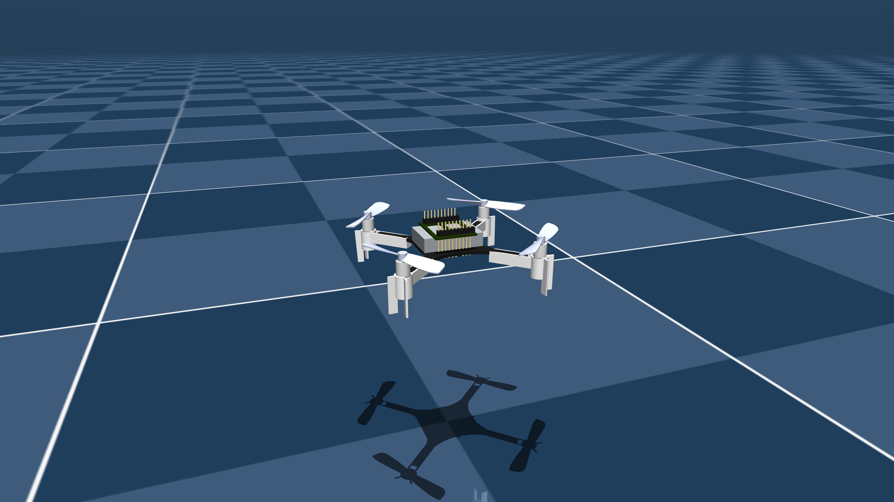</a> | Bitcraze Crazyflie 2 | 0 | [MIT](bitcraze_crazyflie_2/LICENSE) |

**Arms.**

| Preview | Name | DoFs | License |
|:---:|---|---|---|
|  | Franka Emika Panda | 9 | [Apache-2.0](franka_emika_panda/LICENSE) |
|  | Franka Robotics FR3 | 7 | [Apache-2.0](franka_fr3/LICENSE) |
|  | Lite 6 | 6 | [BSD-3-Clause](ufactory_lite6/LICENSE) |
|  | Unitree Z1 | 6 | [BSD-3-Clause](unitree_z1/LICENSE) |
| <a href='https://megahady.github.io/Robot_Lab/?model=catalog/universal_robots_ur5e/scene.xml' title='Open live preview for Universal Robots UR5e'>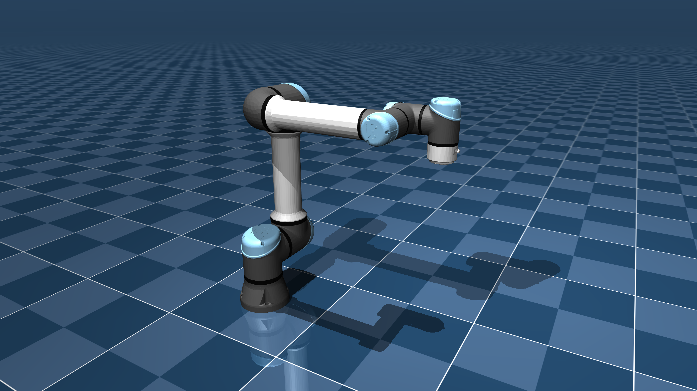</a> | Universal Robots UR5e | 6 | [BSD-3-Clause](universal_robots_ur5e/LICENSE) |
|  | Rethink Robotics Sawyer | 7 | [Apache-2.0](rethink_robotics_sawyer/LICENSE) |
|  | Universal Robots UR10e | 6 | [BSD-3-Clause](universal_robots_ur10e/LICENSE) |
| <a href='https://megahady.github.io/Robot_Lab/?model=catalog/kuka_iiwa_14/scene.xml' title='Open live preview for KUKA LBR iiwa 14'>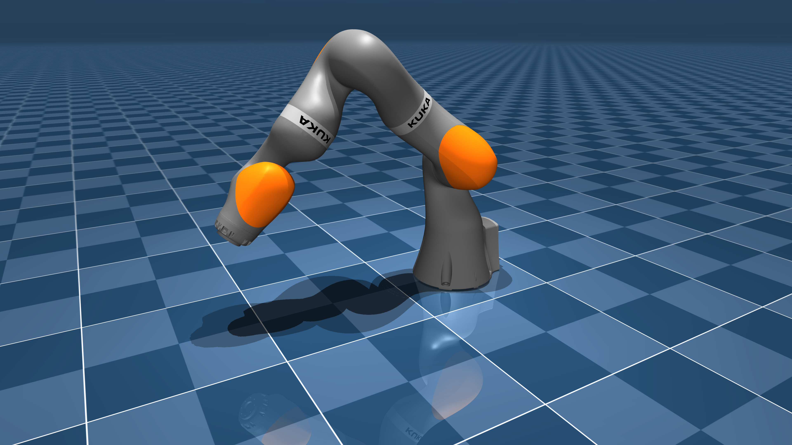</a> | KUKA LBR iiwa 14 | 7 | [BSD-3-Clause](kuka_iiwa_14/LICENSE) |
|  | ViperX 300 6DOF | 8 | [BSD-3-Clause](trossen_vx300s/LICENSE) |
|  | xArm7 | 13 | [BSD-3-Clause](ufactory_xarm7/LICENSE) |
|  | Kinova Gen3 | 7 | [BSD-3-Clause](kinova_gen3/LICENSE) |
| <a href='https://megahady.github.io/Robot_Lab/?model=catalog/agilex_piper/scene.xml' title='Open live preview for AgileX PiPER'>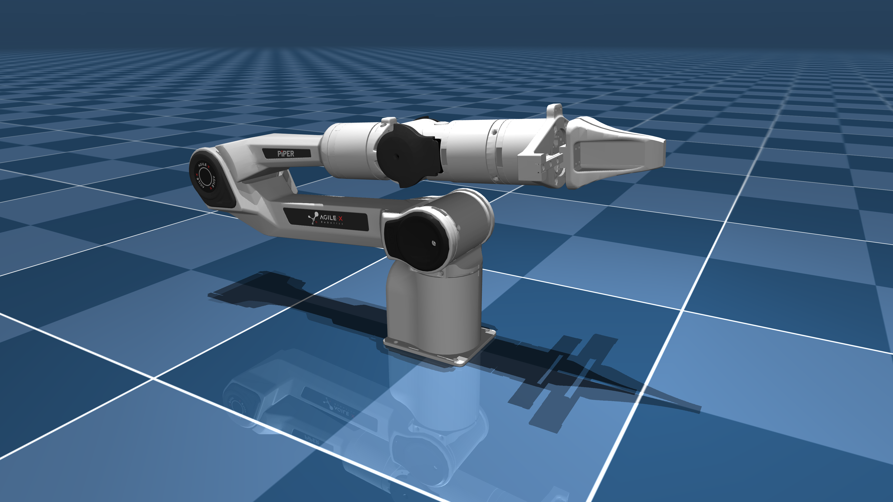</a> | AgileX PiPER | 8 | [MIT](agilex_piper/LICENSE) |
|  | Flexiv Robotics Rizon4 | 7 | [Apache-2.0](flexiv_rizon4/LICENSE) |
|  | ARX L5 | 8 | [BSD-3-Clause](arx_l5/LICENSE) |
| <a href='https://megahady.github.io/Robot_Lab/?model=catalog/flexiv_rizon4s/scene.xml' title='Open live preview for Flexiv Robotics Rizon4S'>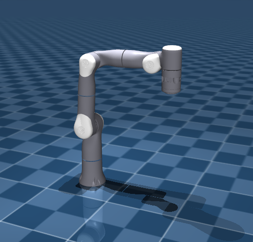</a> | Flexiv Robotics Rizon4S | 7 | [Apache-2.0](flexiv_rizon4s/LICENSE) |
|  | WidowX 250 6DOF | 8 | [BSD-3-Clause](trossen_wx250s/LICENSE) |
|  | Standard Open Arm-100 5DOF - Version 1.3 | 6 | [Apache-2.0](trs_so_arm100/LICENSE) |
|  | Low-Cost Robot Arm | 6 | [Apache-2.0](low_cost_robot_arm/LICENSE) |
| <a href='https://megahady.github.io/Robot_Lab/?model=catalog/i2rt_yam/scene.xml' title='Open live preview for Yet Another Manipulator (YAM)'>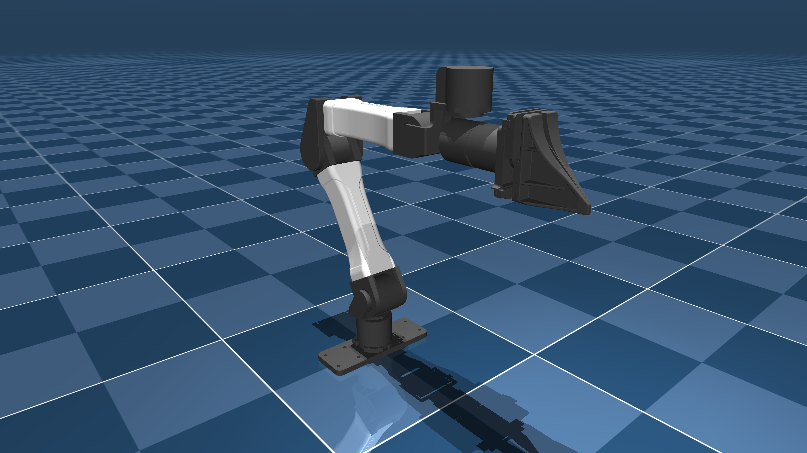</a> | Yet Another Manipulator (YAM) | 8 | [MIT](i2rt_yam/LICENSE) |
|  | Seeed Studio reBot DevArm | 8 | [MIT](seeed_rebot_devarm/LICENSE) |
|  | Dynamixel 2R | 2 | [MIT](dynamixel_2r/LICENSE) |
| <a href='https://megahady.github.io/Robot_Lab/?model=catalog/franka_fr3_v2/scene.xml' title='Open live preview for Franka Robotics FR3 v2'>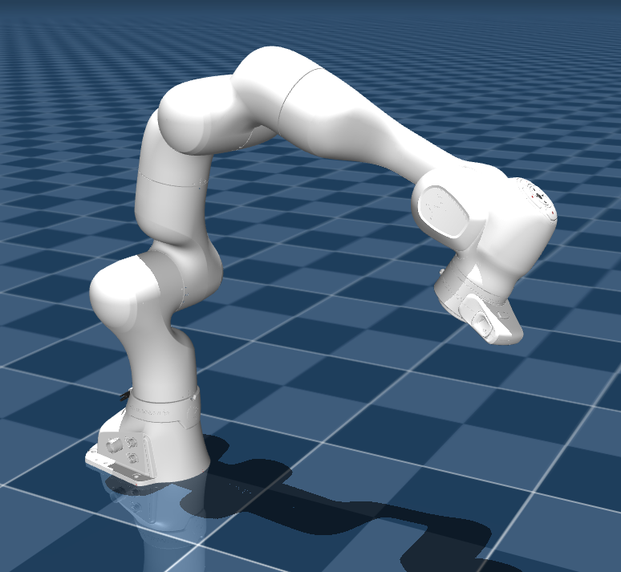</a> | Franka Robotics FR3 v2 | 7 | [Apache-2.0](franka_fr3_v2/LICENSE) |
| <a href='https://megahady.github.io/Robot_Lab/?model=catalog/robotstudio_so101/scene.xml' title='Open live preview for The Robot Studio SO101'>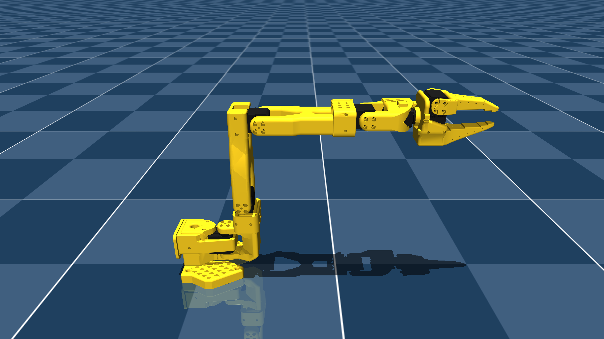</a> | The Robot Studio SO101 | 6 | [Apache-2.0](robotstudio_so101/LICENSE) |
|  | Trossen WXAI | 8 | [BSD-3-Clause](trossen_wxai/LICENSE) |

**End-effectors.**

| Preview | Name | DoFs | License |
|:---:|---|---|---|
|  | Panda Gripper | 2 | [Apache-2.0](franka_emika_panda/LICENSE) |
| <a href='https://megahady.github.io/Robot_Lab/?model=catalog/wonik_allegro/scene_left.xml' title='Open live preview for Allegro Hand V3'>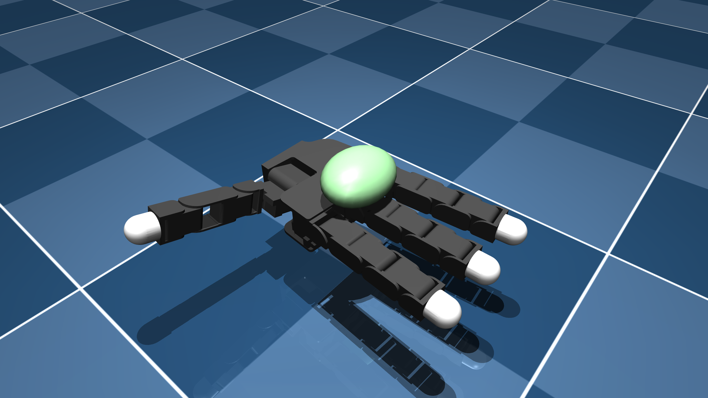</a> | Allegro Hand V3 | 16 | [BSD-2-Clause](wonik_allegro/LICENSE) |
| <a href='https://megahady.github.io/Robot_Lab/?model=catalog/shadow_hand/scene_left.xml' title='Open live preview for Shadow Hand E3M5'>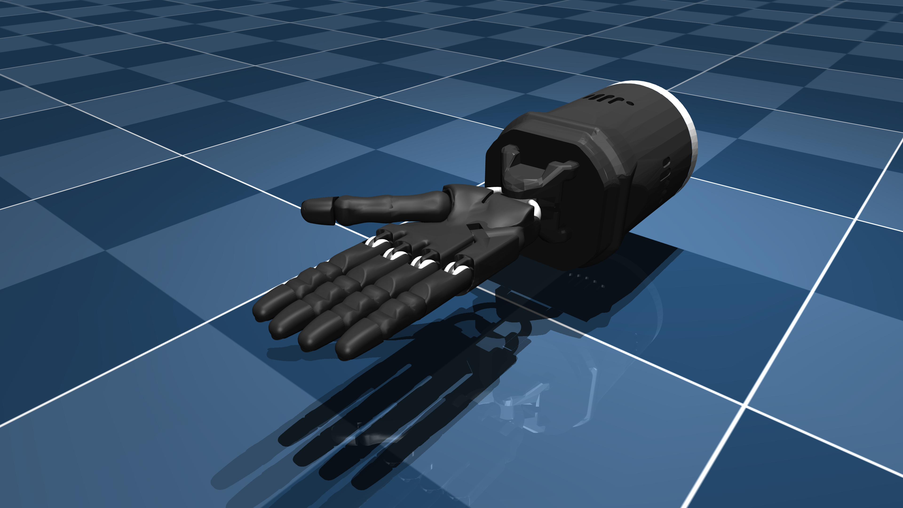</a> | Shadow Hand E3M5 | 24 | [Apache-2.0](shadow_hand/LICENSE) |
|  | Robotiq 2F-85 | 8 | [BSD-2-Clause](robotiq_2f85/LICENSE) |
|  | xarm7 Gripper | 6 | [BSD-3-Clause](ufactory_xarm7/LICENSE) |
|  | Shadow DEX-EE Hand | 12 | [Apache-2.0](shadow_dexee/LICENSE) |
|  | Leap Hand | 16 | [MIT](leap_hand/LICENSE) |
|  | UMI-Gripper | 8 | [MIT](umi_gripper/LICENSE) |
|  | Sharpa Wave | 22 | [Apache-2.0](sharpa_wave/LICENSE) |
|  | Robotiq 2F-85 v4 | 6 | [BSD-2-Clause](robotiq_2f85_v4/LICENSE) |
|  | Tetheria Aero Hand Open | 16 | [Apache-2.0](tetheria_aero_hand_open/LICENSE) |

**Mobile Bases.**

| Preview | Name | DoFs | License |
|:---:|---|---|---|
|  | Robot soccer kit omnidirectional | 64 | [MIT](robot_soccer_kit/LICENSE) |

**Miscellaneous.**

| Preview | Name | DoFs | License |
|:---:|---|---|---|
|  | Realsense D435i | 0 | [Apache-2.0](realsense_d435i/LICENSE) |

<!-- END MODELS -->

### Not available in the browser viewer

Two models cannot be compiled by the stock `@mujoco/mujoco` 3.14.0 WASM build. They run fine from the Python bindings, where the plugin and heap are available:

* **MS-Human-700** — exceeds the WASM heap; needs a build with `-sIMPORTED_MEMORY`
* **Shadow DEX-EE Hand** — requires the compiled `mujoco.pid` plugin, absent from the stock build

## Adding a Robot

Drop a Menagerie-style folder into `catalog/` with `assets/`, a scene XML, `README.md` and `LICENSE`, then regenerate this page. The viewer loads a **scene** file (`scene*.xml`) so the robot arrives with its floor, lighting and skybox; `<include>` and `compiler` `meshdir`/`texturedir` are resolved recursively when staging assets.

## License

These are third-party models. Each robot keeps upstream terms in its own `LICENSE`; [`LICENSE`](LICENSE) aggregates them (MIT, Apache-2.0, BSD-3-Clause and others). Read the per-robot file before redistributing or building on a specific model. Upstream: <https://github.com/google-deepmind/mujoco_menagerie>
