# Robot Catalog

Browseable gallery of every robot checked out from [google-deepmind/mujoco_menagerie](https://github.com/google-deepmind/mujoco_menagerie) — **68 models**, each in its own `name/` folder with meshes (`assets/`), the primary model file, `README.md`, and `LICENSE`. All robot pictures sit alongside the model folders in this directory (one file per image, named `robot__image.png`).

**Legs** is an estimate from the joint names of the model files (quadrupeds → 4, bipeds/humanoids → 2, arms and fixed-base arms are blank). **Description** is extracted from the robot's `README.md` overview. Both are best-effort summaries that will later grow to cover the robot's controllers, state estimators, and RL policies.

The catalog is a plain copy: nothing here is installed, built, or converted. Use it with MuJoCo directly, e.g.

```python
import mujoco
model = mujoco.MjModel.from_xml_path("src/catalog/unitree_h1/h1.xml")
```

## Index

| | Robot | Legs | Model | License | Description |
|---|---|---|---|---|---|
|  | **agilex_piper** | — | [`piper.xml`](agilex_piper/piper.xml) | `MIT` | This package contains a simplified robot description (MJCF) of the AgileX PiPER. It is derived from the publicly available model. |
| 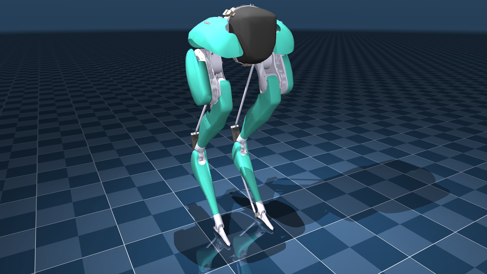 | **agility_cassie** | 2 | [`cassie.xml`](agility_cassie/cassie.xml) | `other/see LICENSE` | This package contains a simplified robot description (MJCF) of the Cassie bipedal robot. The original MJCF and assets were provided directly by Agility Robotics under an MIT Licens |
|  | **aloha** | — | [`aloha.xml`](aloha/aloha.xml) | `other/see LICENSE` | This package contains a simplified robot description (MJCF) of the bimanual ALOHA 2 robot. It is derived from the publicly available ViperX 300 6DOF MJCF model. |
|  | **anybotics_anymal_b** | 4 | [`anymal_b.xml`](anybotics_anymal_b/anymal_b.xml) | `other/see LICENSE` | This package contains a simplified robot description (MJCF) of the ANYmal B robot developed by ANYbotics. It is derived from the publicly available URDF description. |
| 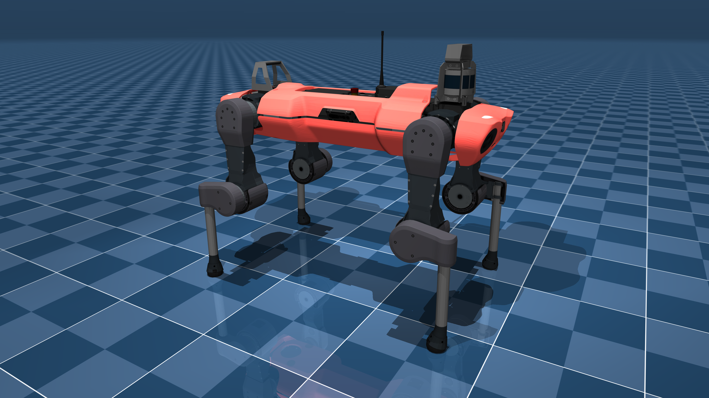 | **anybotics_anymal_c** | 4 | [`anymal_c.xml`](anybotics_anymal_c/anymal_c.xml) | `other/see LICENSE` | This package contains a simplified robot description (MJCF) of the ANYmal C robot developed by ANYbotics. It is derived from the publicly available URDF description. |
| 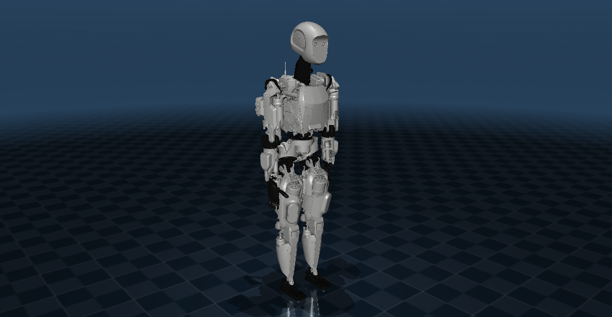 | **apptronik_apollo** | 2 | [`apptronik_apollo.xml`](apptronik_apollo/apptronik_apollo.xml) | `Apache-2.0` | This package contains a Apptronik Apollo robot description (MJCF). |
| 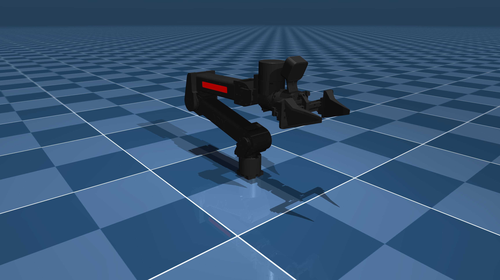 | **arx_l5** | — | [`arx_l5.xml`](arx_l5/arx_l5.xml) | `BSD-3-Clause` | This package contains a simplified robot description (MJCF) of the ARX L5. It is derived from ARX's official model repository. |
| 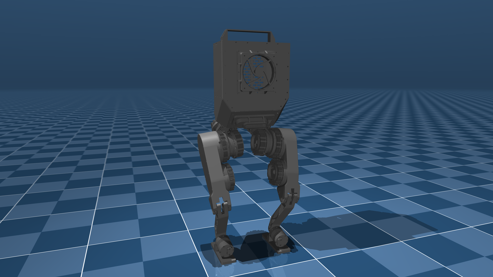 | **berkeley_humanoid** | 2 | [`berkeley_humanoid.xml`](berkeley_humanoid/berkeley_humanoid.xml) | `other/see LICENSE` | This package contains a simplified robot description (MJCF) of the Berkeley Humanoid developed by the Hybrid Robotics Lab at UC Berkeley. |
|  | **bitcraze_crazyflie_2** | — | [`cf2.xml`](bitcraze_crazyflie_2/cf2.xml) | `MIT` | This package contains a simplified robot description (MJCF) of the Crazyflie 2 model from Bitcraze. It is derived from the publicly available ROS description. |
| 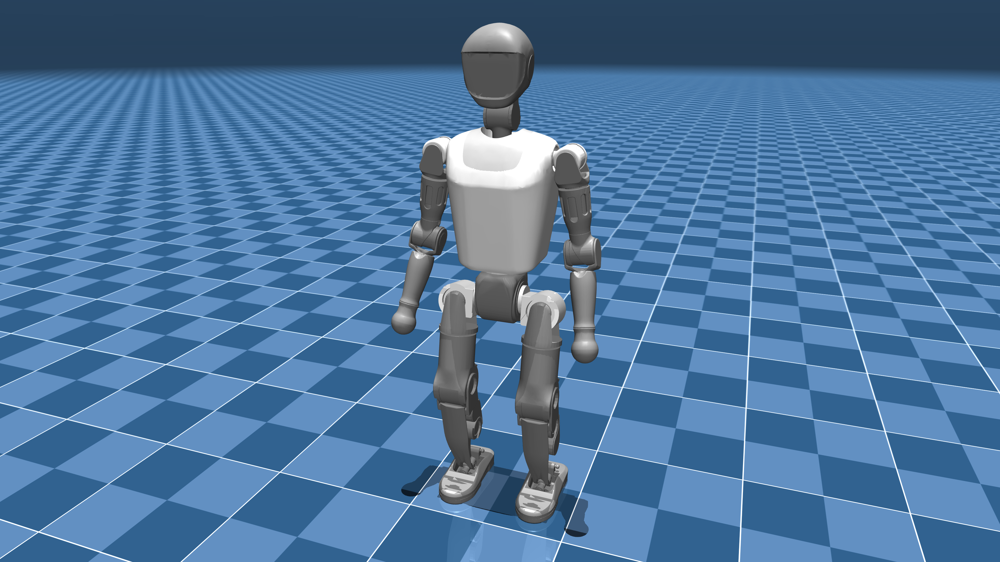 | **booster_t1** | 2 | [`t1.xml`](booster_t1/t1.xml) | `Apache-2.0` | This package contains a simplified robot description (MJCF) of the T1 Humanoid Robot developed by Booster Robotics. It is derived from the publicly available URDF description. |
| 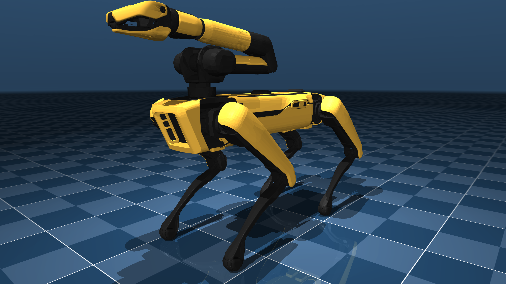 | **boston_dynamics_spot** | 4 | [`spot.xml`](boston_dynamics_spot/spot.xml) | `BSD-3-Clause` | This package contains a simplified robot description (MJCF) of the Spot Quadruped developed by Boston Dynamics. It is derived from the publicly available URDF description. |
| 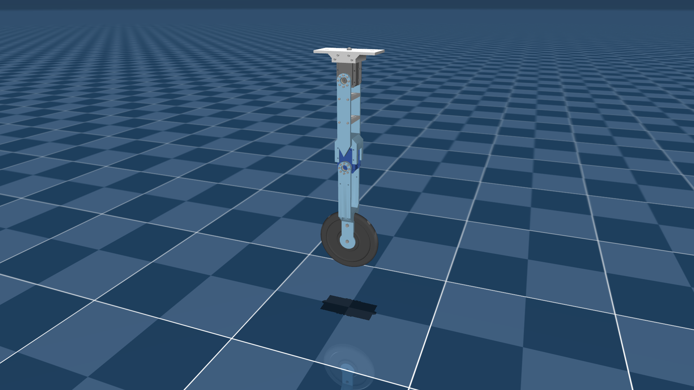 | **dynamixel_2r** | — | [`dynamixel_2r.xml`](dynamixel_2r/dynamixel_2r.xml) | `other/see LICENSE` | This package contains a 2R testbench arm featuring MX-106 and MX-64 Dynamixel actuators. |
| 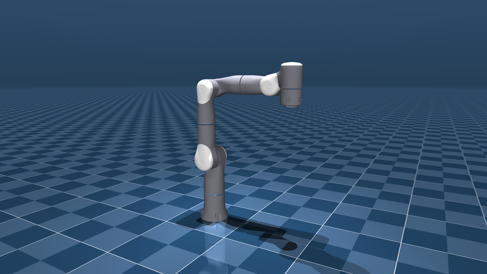 | **flexiv_rizon4** | — | [`flexiv_rizon4.xml`](flexiv_rizon4/flexiv_rizon4.xml) | `Apache-2.0` | This package contains a MuJoCo robot description (MJCF) of Rizon4 developed by Flexiv Robotics. |
|  | **flexiv_rizon4s** | — | [`flexiv_rizon4s.xml`](flexiv_rizon4s/flexiv_rizon4s.xml) | `Apache-2.0` | This package contains a MuJoCo robot description (MJCF) of Rizon4S developed by Flexiv Robotics. |
|  | **flybody** | 2 | [`fruitfly.xml`](flybody/fruitfly.xml) | `Apache-2.0` | flybody is an anatomically-detailed body model of the fruit fly [Drosophila melanogaster]. The fly model was developed in a collaborative effort by Google DeepMind and HHMI Janelia |
| 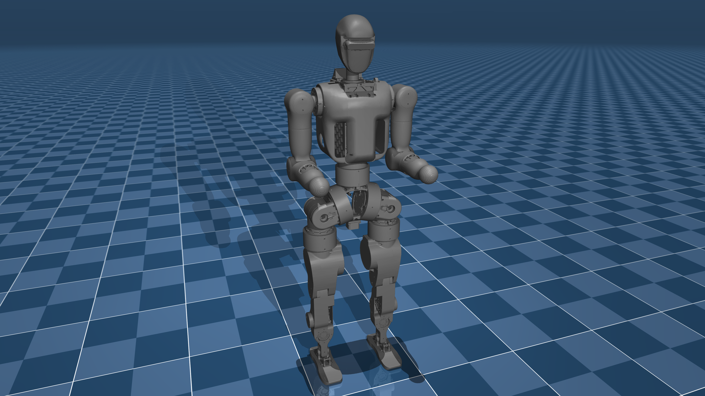 | **fourier_n1** | 2 | [`n1.xml`](fourier_n1/n1.xml) | `Apache-2.0` | This package contains a simplified robot description (MJCF) of the Fourier N1 Humanoid Robot developed by Fourier. It is derived from the Fourier N1 URDF Description. |
| 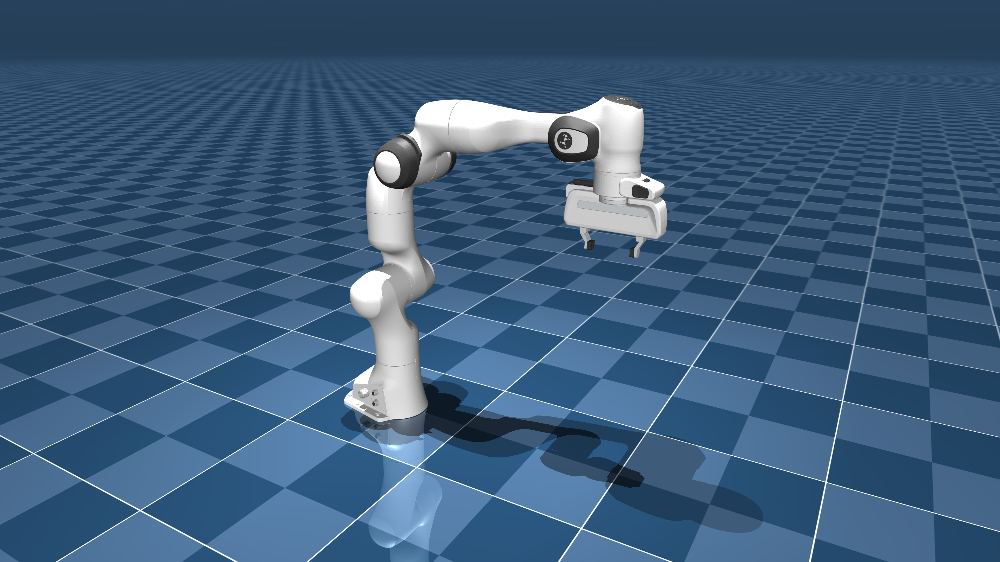 | **franka_emika_panda** | — | [`mjx_panda.xml`](franka_emika_panda/mjx_panda.xml) | `Apache-2.0` | This package contains a simplified robot description (MJCF) of the Franka Emika Panda developed by Franka Emika. It is derived from the publicly available URDF description. |
| 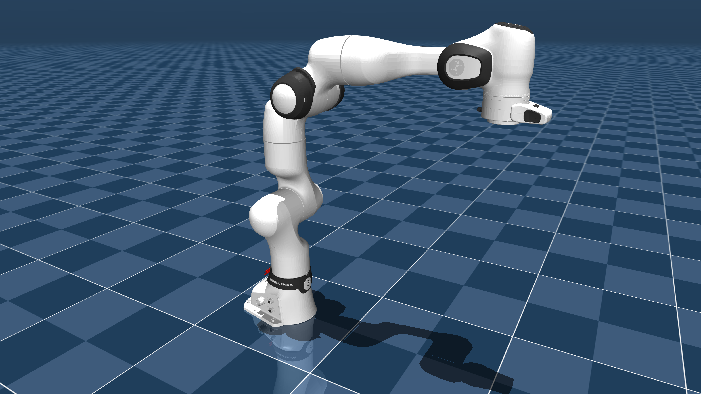 | **franka_fr3** | — | [`fr3.xml`](franka_fr3/fr3.xml) | `Apache-2.0` | This package contains a simplified robot description (MJCF) of the Franka Research 3 (aka FR3) developed by Franka Robotics (formerly Franka Emika). |
|  | **franka_fr3_v2** | — | [`fr3v2.xml`](franka_fr3_v2/fr3v2.xml) | `Apache-2.0` | This package contains a simplified robot description (MJCF) of the Franka Research 3 (aka FR3) developed by Franka Robotics (formerly Franka Emika). |
|  | **google_barkour_v0** | 4 | [`barkour_v0.urdf`](google_barkour_v0/barkour_v0.urdf) | `Apache-2.0` | This package contains a simplified robot description (MJCF) of the Barkour v0 Quadruped developed by Google. |
|  | **google_barkour_vb** | 4 | [`barkour_vb.xml`](google_barkour_vb/barkour_vb.xml) | `Apache-2.0` | This package contains a simplified robot description (MJCF) of the Barkour vB Quadruped developed by Google. |
|  | **google_robot** | — | [`robot.xml`](google_robot/robot.xml) | `Apache-2.0` | This package contains a simplified robot description (MJCF) of a mobile manipulator with a 7 degree-of-freedom (DoF) arm and a parallel jaw gripper developed by Google. |
| 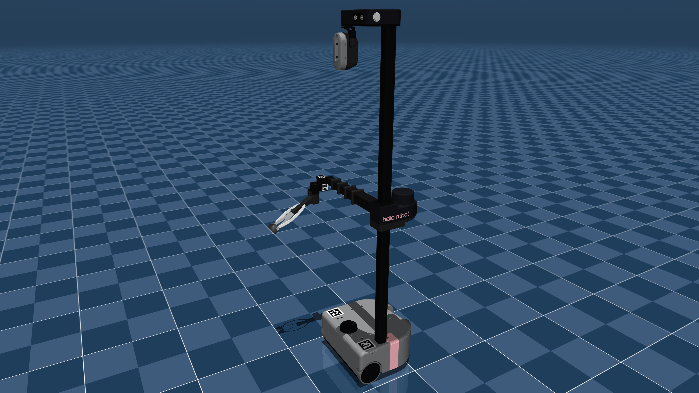 | **hello_robot_stretch** | — | [`stretch.xml`](hello_robot_stretch/stretch.xml) | `other/see LICENSE` | This package contains a simplified robot description (MJCF) of the Hello Robot Stretch 2 developed by Hello Robot. The original URDF and assets were provided directly by Hello Robo |
| 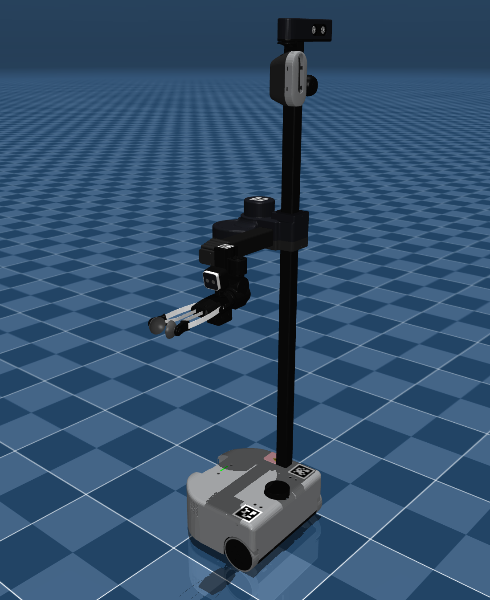 | **hello_robot_stretch_3** | — | [`stretch.xml`](hello_robot_stretch_3/stretch.xml) | `Apache-2.0` | This package contains the robot description (MJCF) of the Hello Robot Stretch 3 developed by Hello Robot. This model was directly provided by Hello Robot under the Apache 2.0. |
|  | **i2rt_yam** | — | [`yam.xml`](i2rt_yam/yam.xml) | `MIT` | This package contains a simplified robot description (MJCF) of the YAM robot developed by I2 RT Robotics. It is derived from the publicly available URDF description. |
| 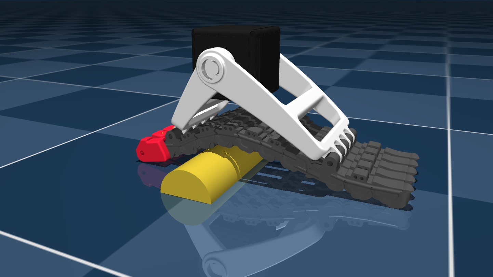 | **iit_softfoot** | — | [`softfoot.xml`](iit_softfoot/softfoot.xml) | `other/see LICENSE` | This package is a reproduction of the simplified robot description (MJCF) developed by the by IIT Soft Robotics for Human Cooperation and Rehabilitation group for the Natural Machi |
| 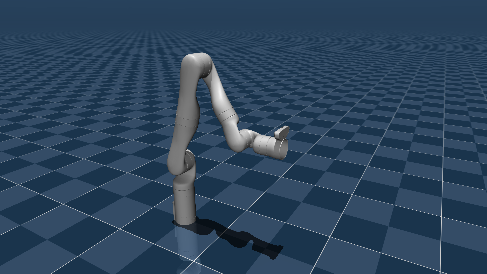 | **kinova_gen3** | — | [`gen3.xml`](kinova_gen3/gen3.xml) | `other/see LICENSE` | This package contains a simplified robot description (MJCF) of the Kinova Gen3 developed by Kinova Robotics. It is derived from the publicly available URDF description. |
|  | **kuka_iiwa_14** | — | [`iiwa14.xml`](kuka_iiwa_14/iiwa14.xml) | `BSD-3-Clause` | This package contains a simplified robot description (MJCF) of the LBR iiwa 14kg developed by KUKA Robotics. It is derived from the publicly available URDF description created by t |
| 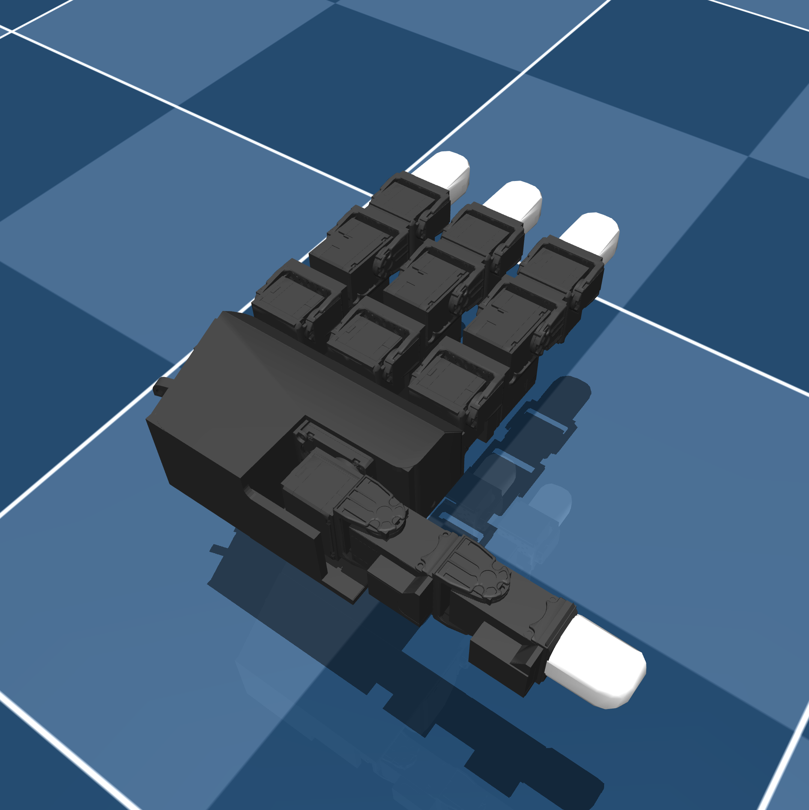 | **leap_hand** | — | [`scene_left.xml`](leap_hand/scene_left.xml) | `other/see LICENSE` | This package contains a simplified robot description (MJCF) of the (left and right) LEAP Hand developed by Carnegie Mellon University. |
| 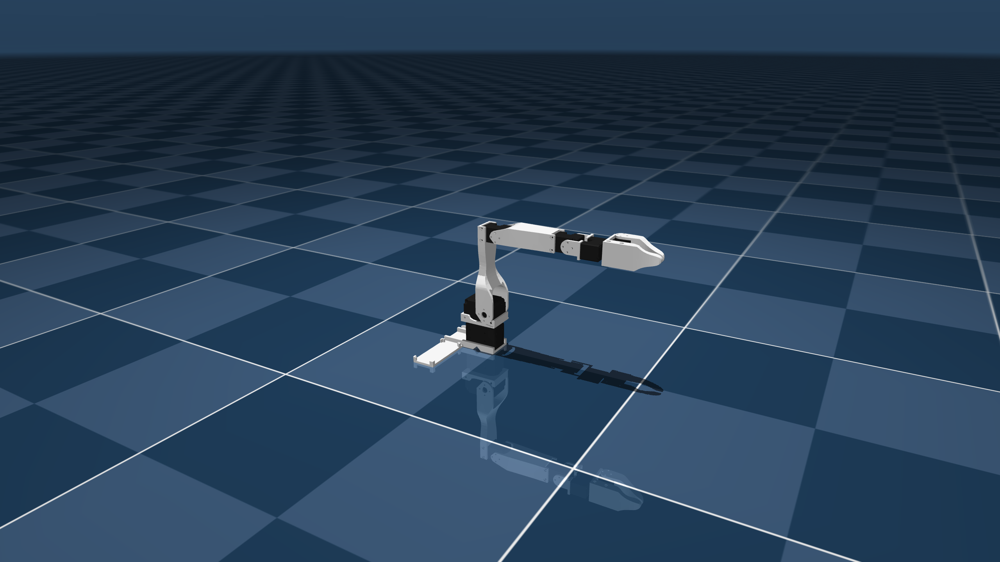 | **low_cost_robot_arm** | — | [`low_cost_robot_arm.xml`](low_cost_robot_arm/low_cost_robot_arm.xml) | `Apache-2.0` | This package contains a simplified robot description (MJCF) of the **Low-Cost Robot Arm** developed originally by Alexander Koch and updated by HuggingFace LeRobot Team with the na |
| 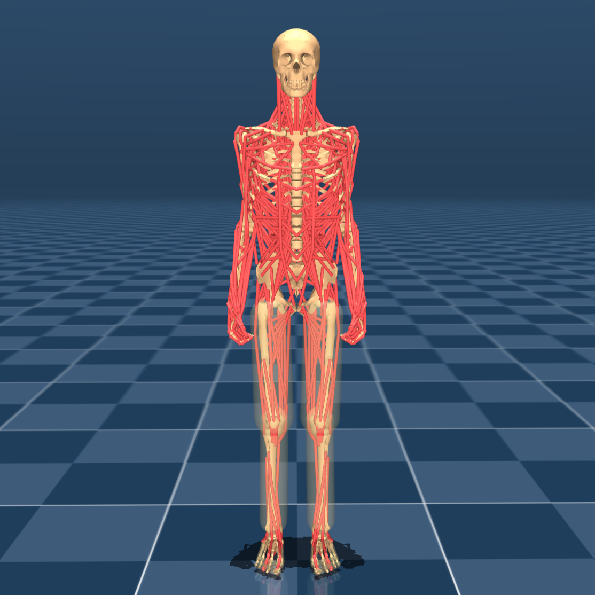 | **ms_human_700** | 2 | [`MS-Human-700-Locomotion.xml`](ms_human_700/MS-Human-700-Locomotion.xml) | `Apache-2.0` | This package contains a Human MusculoSkeletal model description (MJCF) of the MS-Human-700 model developed by the LNS Group. |
| 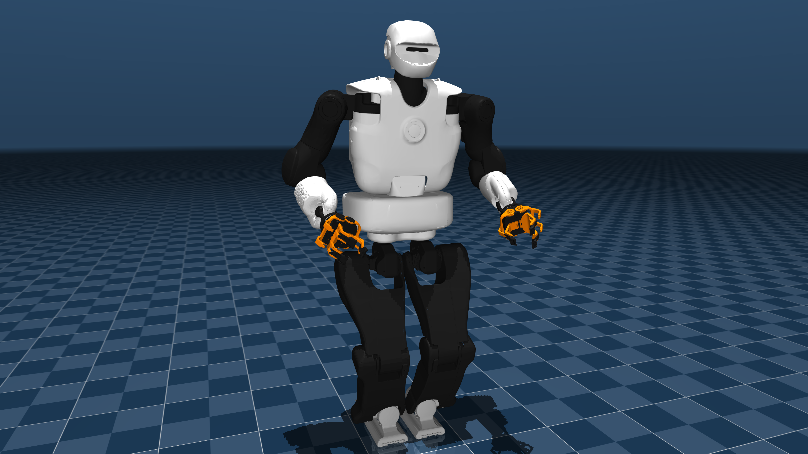 | **pal_talos** | 2 | [`talos.xml`](pal_talos/talos.xml) | `Apache-2.0` | This package contains a simplified robot description (MJCF) of the TALOS Robot by PAL Robotics. It is derived from the publicly available URDF description. |
|  | **pal_tiago** | — | [`scene_velocity.xml`](pal_tiago/scene_velocity.xml) | `Apache-2.0` | This package contains a simplified robot description (MJCF) of the TIAGo Robot by PAL Robotics. It is derived from the publicly available URDF description. |
| 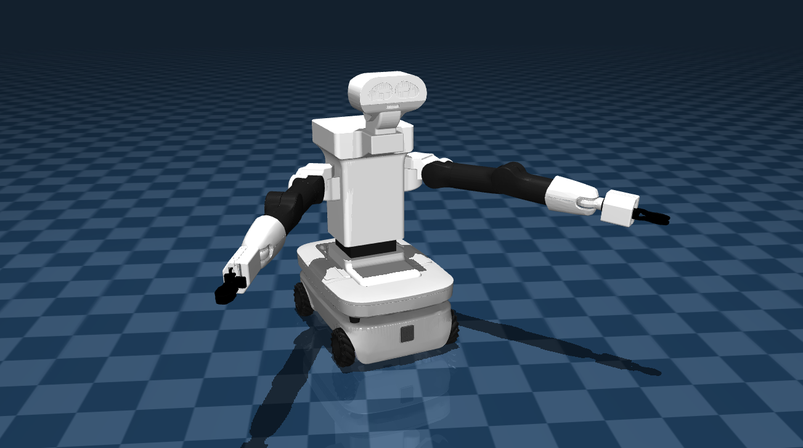 | **pal_tiago_dual** | — | [`scene_velocity.xml`](pal_tiago_dual/scene_velocity.xml) | `Apache-2.0` | This package contains a simplified robot description (MJCF) of the TIAGo++ Robot with omnidirectional base by PAL Robotics. |
| 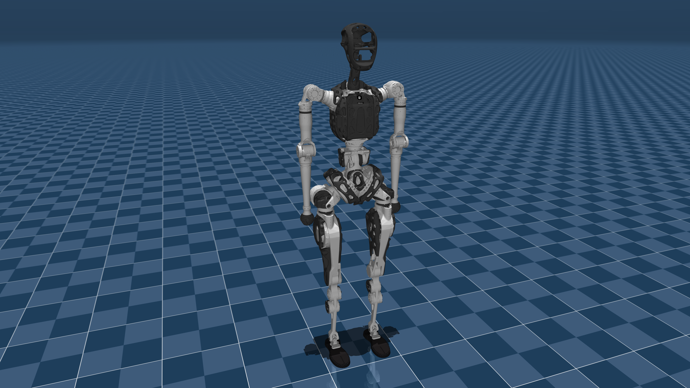 | **pndbotics_adam_lite** | 2 | [`adam_lite.xml`](pndbotics_adam_lite/adam_lite.xml) | `MIT` | This package contains a simplified robot description (MJCF) of the Adam_lite humanoid robot developed by PNDbotics. |
| 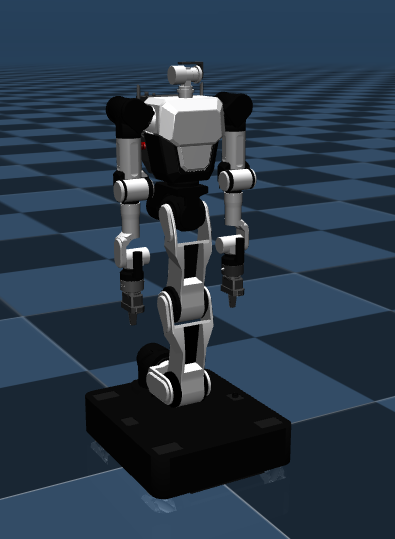 | **rainbow_robotics_rby1** | — | [`rby1a_1.2.xml`](rainbow_robotics_rby1/rby1a_1.2.xml) | `Apache-2.0` | This package contains MuJoCo MJCF models for RBY1 by Rainbow Robotics, including: - `RBY1-A` base (`1.2`) - `RBY1-M` base (`1.2`, `1.3`) - full gripper and `no_gripper` variants |
| 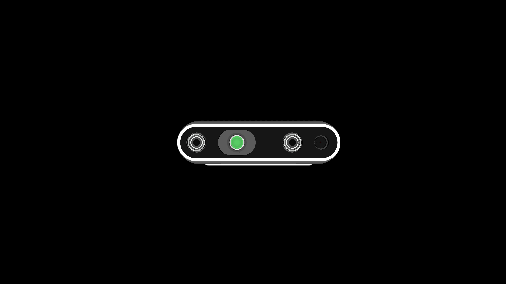 | **realsense_d435i** | — | [`d435i.xml`](realsense_d435i/d435i.xml) | `Apache-2.0` | This package contains a simplified robot description (MJCF) of the Realsense D435i camera developed by Intel. It is derived from the publicly available URDF description with modifi |
| 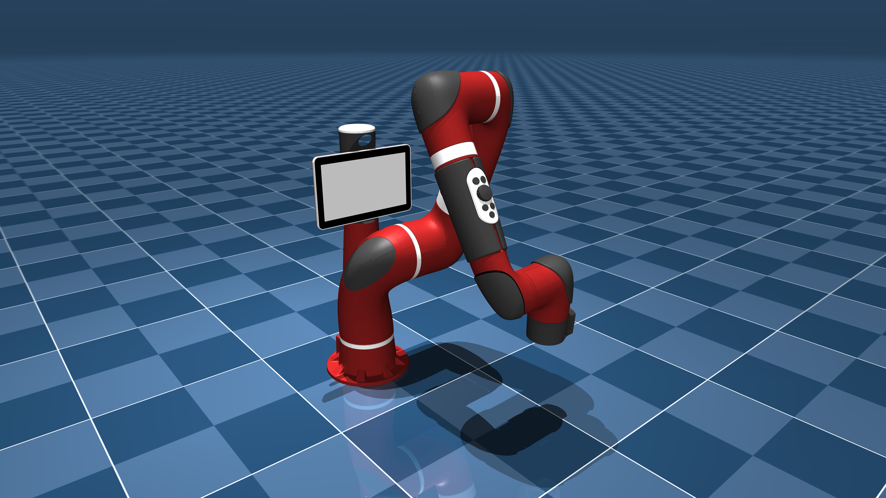 | **rethink_robotics_sawyer** | — | [`sawyer.xml`](rethink_robotics_sawyer/sawyer.xml) | `Apache-2.0` | This package contains a simplified robot description (MJCF) of the Sawyer developed by Rethink Robotics. It is derived from the publicly available URDF description. |
| 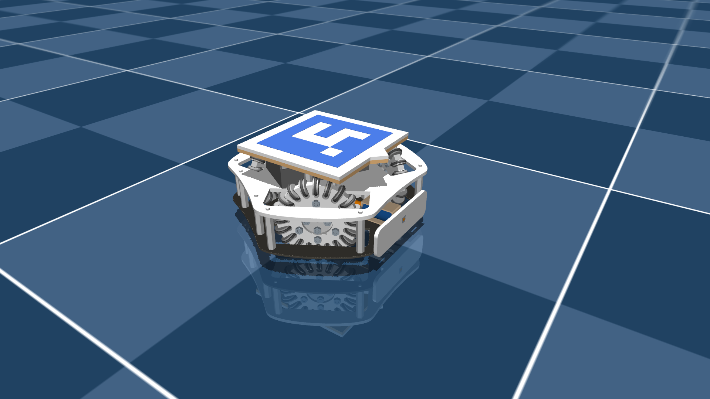 | **robot_soccer_kit** | — | [`robot_soccer_kit.xml`](robot_soccer_kit/robot_soccer_kit.xml) | `other/see LICENSE` | This package contains a robot description (MJCF) of a Robot Soccer Kit omnidirectional robot. All passive wheels (20 per wheel) are simulated as passive joints. |
| 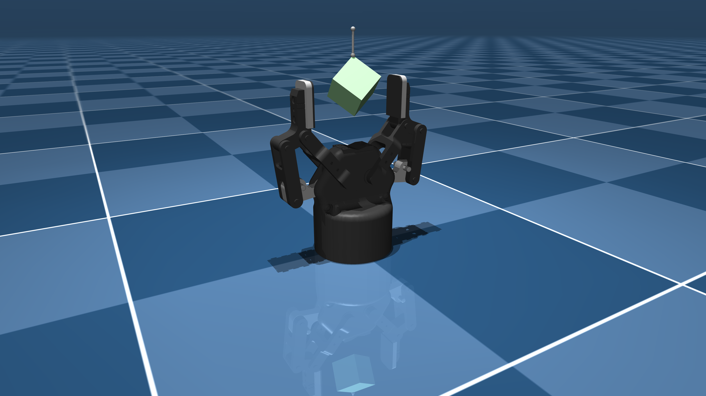 | **robotiq_2f85** | — | [`2f85.xml`](robotiq_2f85/2f85.xml) | `other/see LICENSE` | This package contains a simplified robot description (MJCF) of the Robotiq 85mm 2-Finger Adaptive Gripper developed by Robotiq. |
| 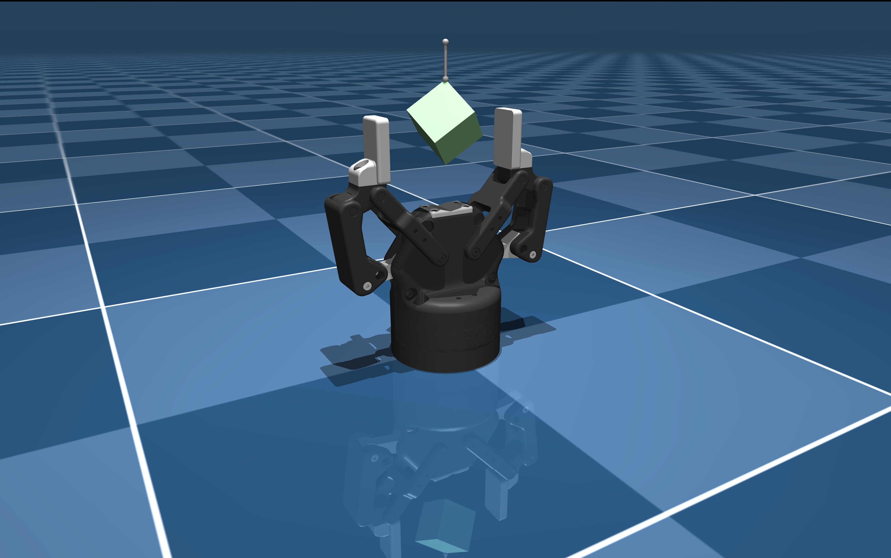 | **robotiq_2f85_v4** | — | [`2f85.xml`](robotiq_2f85_v4/2f85.xml) | `other/see LICENSE` | This package contains a simplified robot description (MJCF) of the Robotiq 85mm 2-Finger Adaptive Gripper developed by Robotiq. |
| 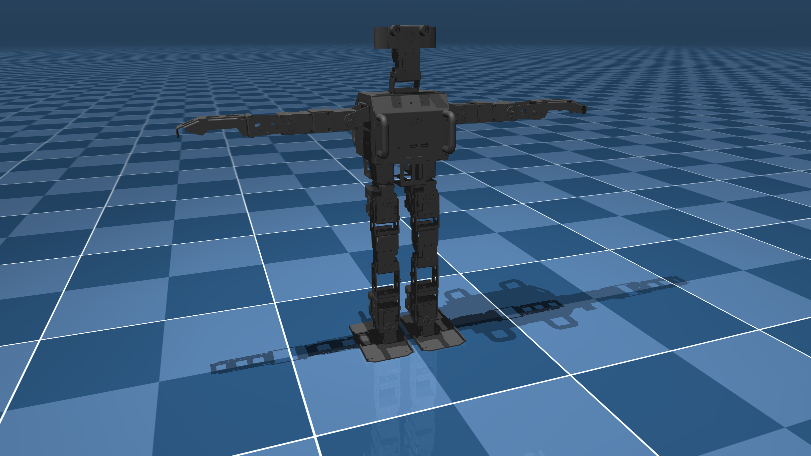 | **robotis_op3** | 2 | [`op3.xml`](robotis_op3/op3.xml) | `Apache-2.0` | This package contains a simplified robot description (MJCF) of the Robotis OP3 developed by Robotis. It is derived from the publicly available URDF description. |
|  | **robotstudio_so101** | — | [`scene_box.xml`](robotstudio_so101/scene_box.xml) | `Apache-2.0` | This package contains a robot description (MJCF) of the The Robot Studio SO101 robot developed by [I2 RT Robotics]. It is derived from the publicly available MJCF. |
| 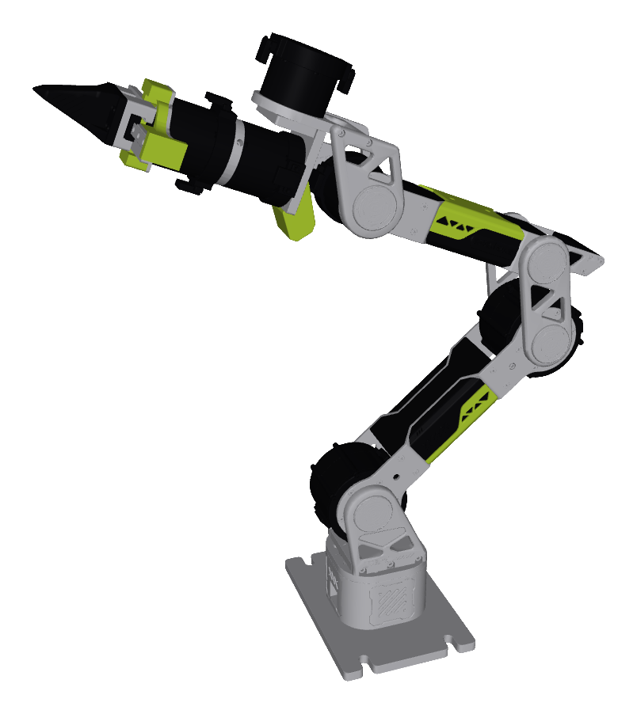 | **seeed_rebot_devarm** | — | [`seeed_rebot_devarm.xml`](seeed_rebot_devarm/seeed_rebot_devarm.xml) | `MIT` | This package contains a robot description (MJCF) of the **reBot DevArm**, a 6-DOF manipulator with a 2-finger parallel gripper built by Seeed Studio around RobStride quasi-direct-d |
| 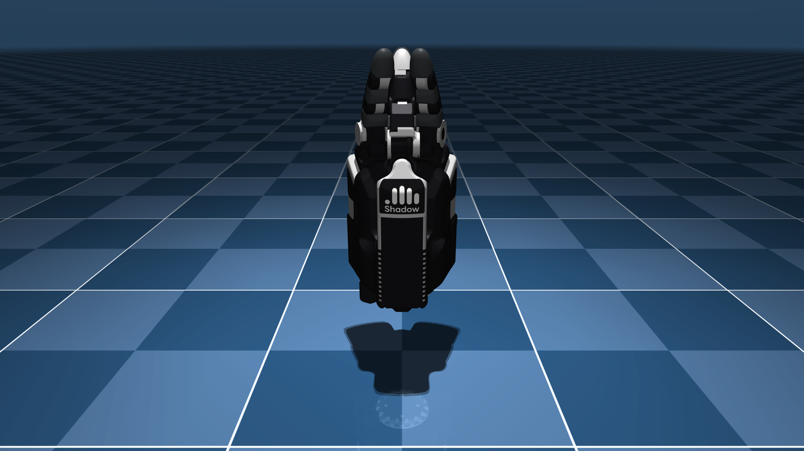 | **shadow_dexee** | — | [`shadow_dexee.xml`](shadow_dexee/shadow_dexee.xml) | `Apache-2.0` | This package contains a simplified robot description (MJCF) of the SHADOW-DEX-EE-HAND developed by the Shadow Robot Company. |
|  | **shadow_hand** | — | [`keyframes.xml`](shadow_hand/keyframes.xml) | `Apache-2.0` | This package contains assets of the "E3M5" version of the Shadow Hand robot, including both right-handed and left-handed versions. |
| 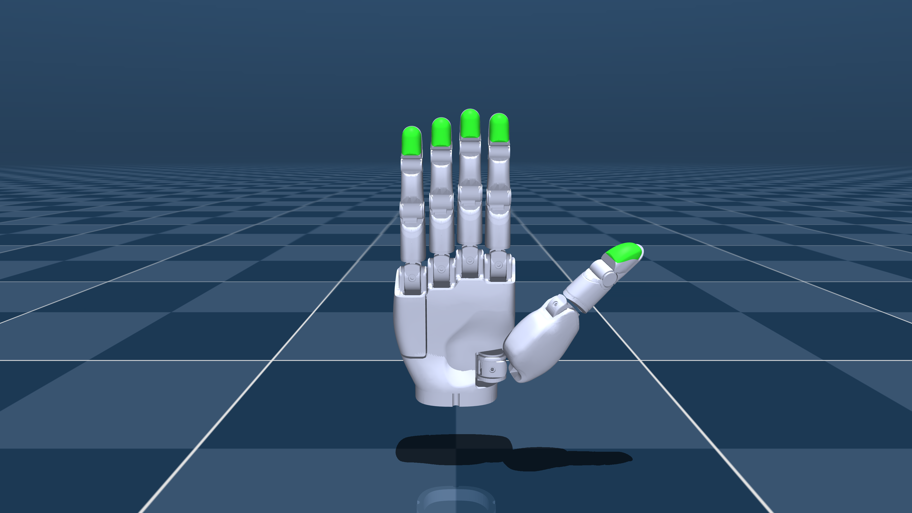 | **sharpa_wave** | — | [`scene_left.xml`](sharpa_wave/scene_left.xml) | `Apache-2.0` | This package contains a simplified robot description (MJCF) of the **Sharpa Wave** five-fingered tactile hand developed by Sharpa Robotics. |
| 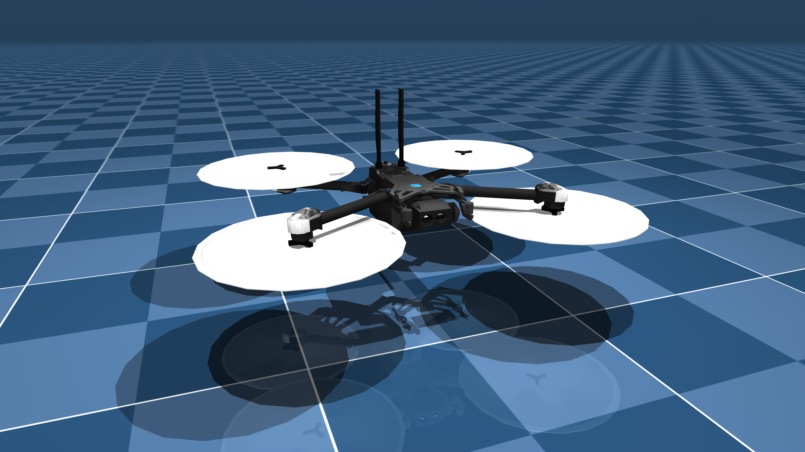 | **skydio_x2** | — | [`x2.xml`](skydio_x2/x2.xml) | `Apache-2.0` | This package contains a simplified robot description (MJCF) of the Skydio X2 drone developed by Skydio. The assets were provided directly by Skydio under the Apache 2.0 License. |
|  | **stanford_tidybot** | — | [`base.xml`](stanford_tidybot/base.xml) | `MIT` | This package contains a simplified robot description (MJCF) of the Stanford TidyBot developed by Jimmy Wu and collaborators from the Interactive Perception and Robot Learning Lab a |
| 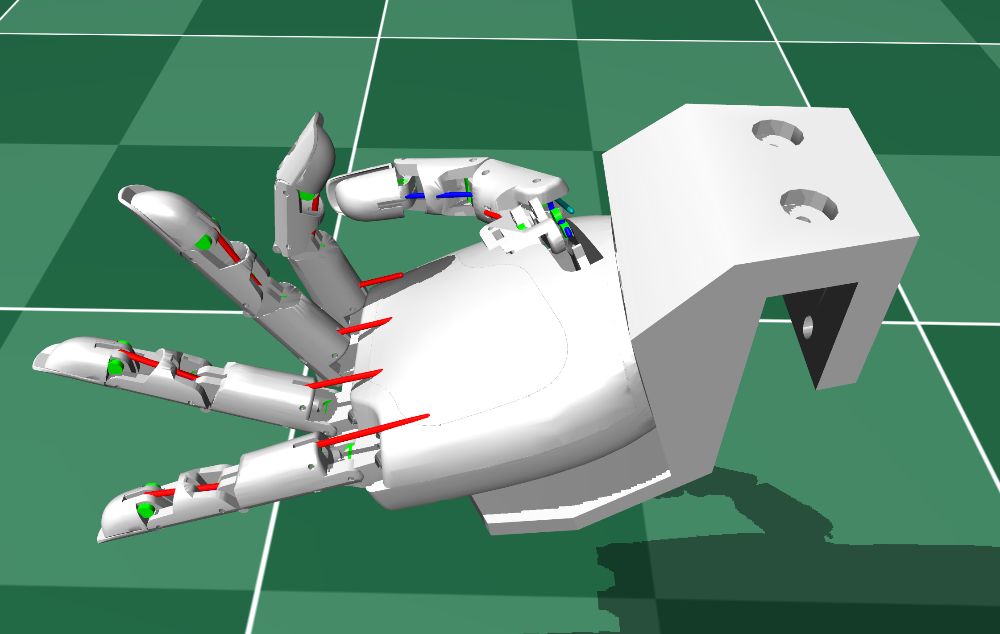 | **tetheria_aero_hand_open** | — | [`scene_right.xml`](tetheria_aero_hand_open/scene_right.xml) | `Apache-2.0` | This package contains a **tendon-driven** robotic hand model for MuJoCo manipulation tasks. The Tetheria Hand features accurate cable-driven actuation with spatial tendons, springs |
|  | **toddlerbot_2xc** | 2 | [`scene_mjx.xml`](toddlerbot_2xc/scene_mjx.xml) | `MIT` | This package contains the MJCF of Stanford ToddlerBot (the 2XC variant). |
| 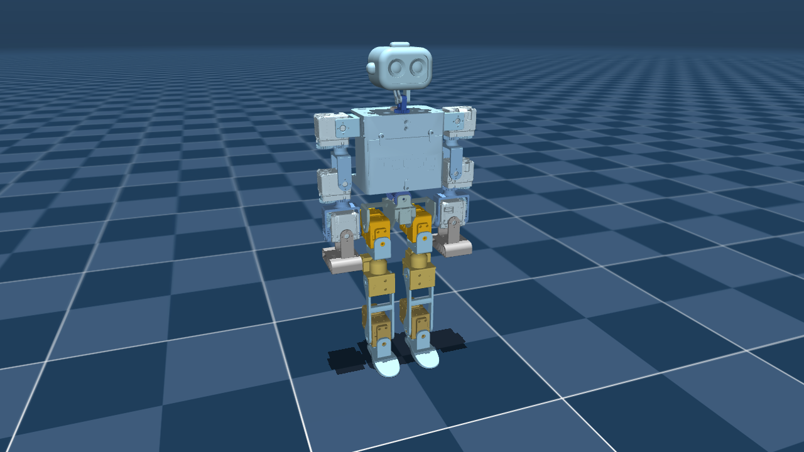 | **toddlerbot_2xm** | 2 | [`scene_mjx.xml`](toddlerbot_2xm/scene_mjx.xml) | `MIT` | This package contains the MJCF of Stanford ToddlerBot (the 2XM variant). |
| 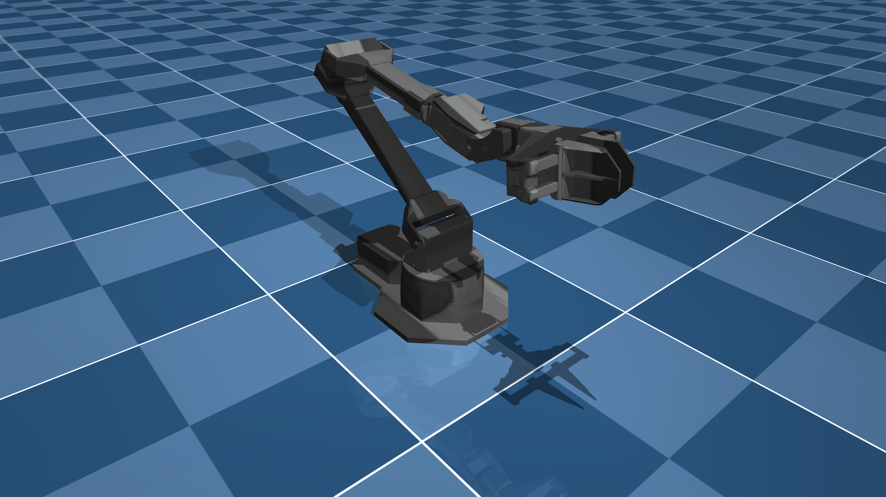 | **trossen_vx300s** | — | [`vx300s.xml`](trossen_vx300s/vx300s.xml) | `other/see LICENSE` | This package contains a simplified robot description (MJCF) of the ViperX 300 6DOF developed by Trossen Robotics. It is derived from the publicly available URDF description. |
| 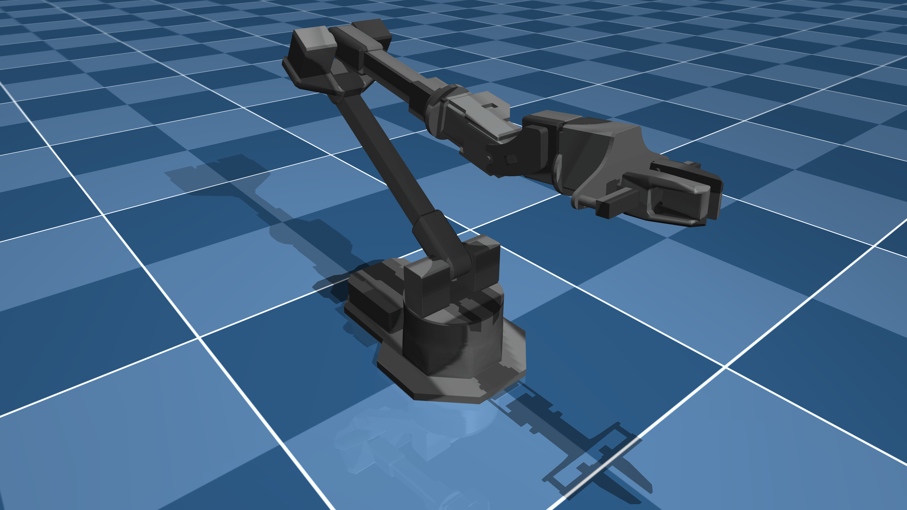 | **trossen_wx250s** | — | [`wx250s.xml`](trossen_wx250s/wx250s.xml) | `other/see LICENSE` | This package contains a simplified robot description (MJCF) of the WidowX 250 6DOF developed by Trossen Robotics. It is derived from the publicly available URDF description. |
| 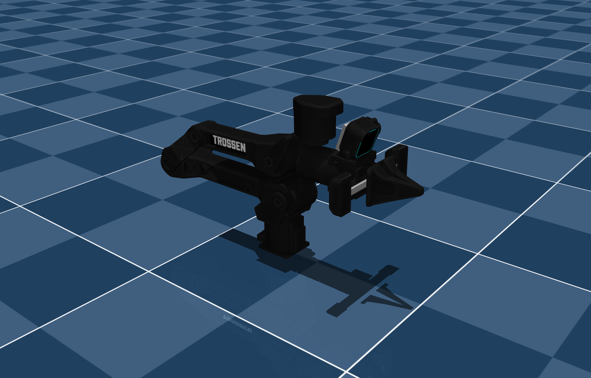 | **trossen_wxai** | — | [`wxai_follower.xml`](trossen_wxai/wxai_follower.xml) | `BSD-3-Clause` | This package contains a simplified robot description (MJCF) of the Trossen WXAI developed by Trossen Robotics. It is derived from the publicly available URDF description. |
| 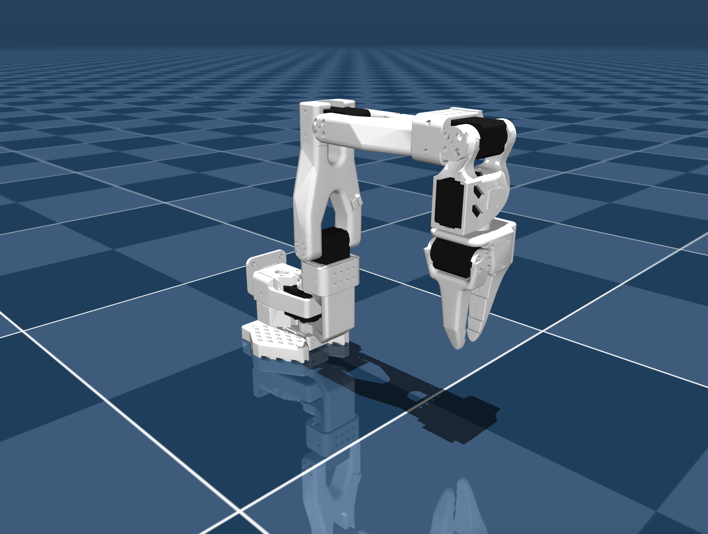 | **trs_so_arm100** | — | [`so_arm100.xml`](trs_so_arm100/so_arm100.xml) | `Apache-2.0` | This package contains a simplified robot description (MJCF) of the Standard Open Arm-100 developed by The Robot Studio. It is derived from the publicly available URDF description. |
| 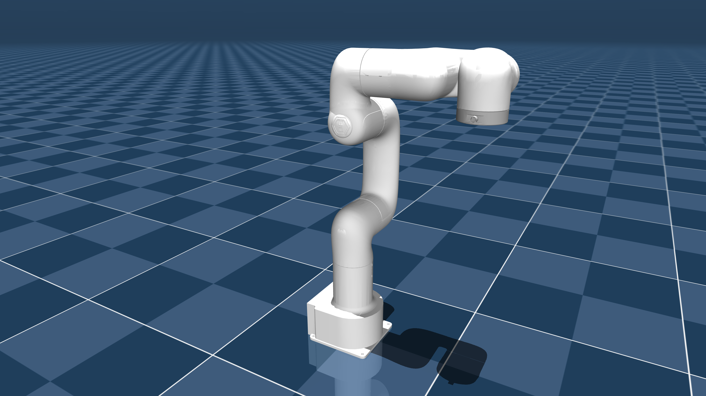 | **ufactory_lite6** | — | [`lite6.xml`](ufactory_lite6/lite6.xml) | `other/see LICENSE` | This package contains a simplified robot description (MJCF) of the Lite 6 developed by UFactory. It is derived from the publicly available URDF description. |
| 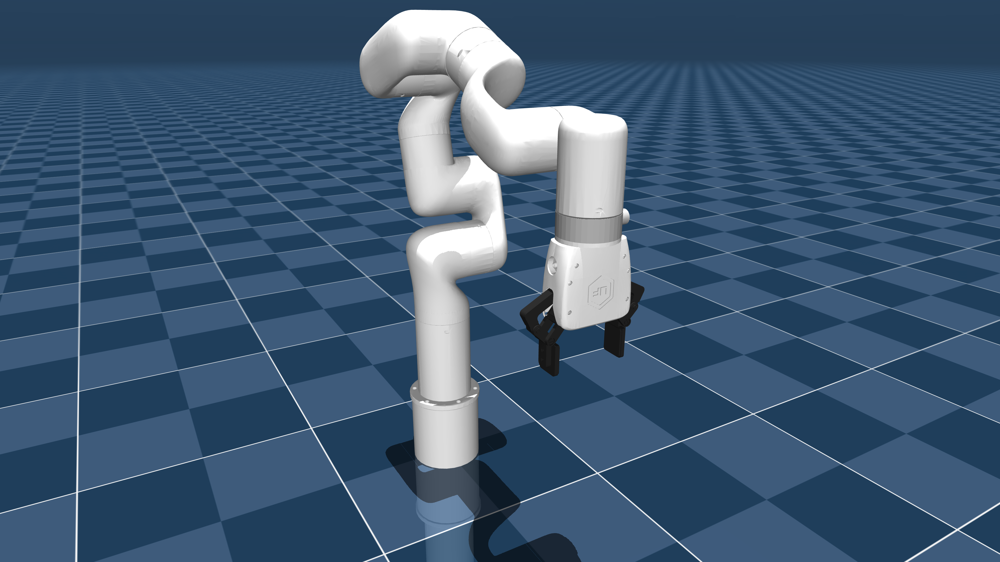 | **ufactory_xarm7** | — | [`xarm7.xml`](ufactory_xarm7/xarm7.xml) | `other/see LICENSE` | This package contains a simplified robot description (MJCF) of the xArm7 arm developed by UFACTORY. It is derived from the publicly available URDF description. |
| 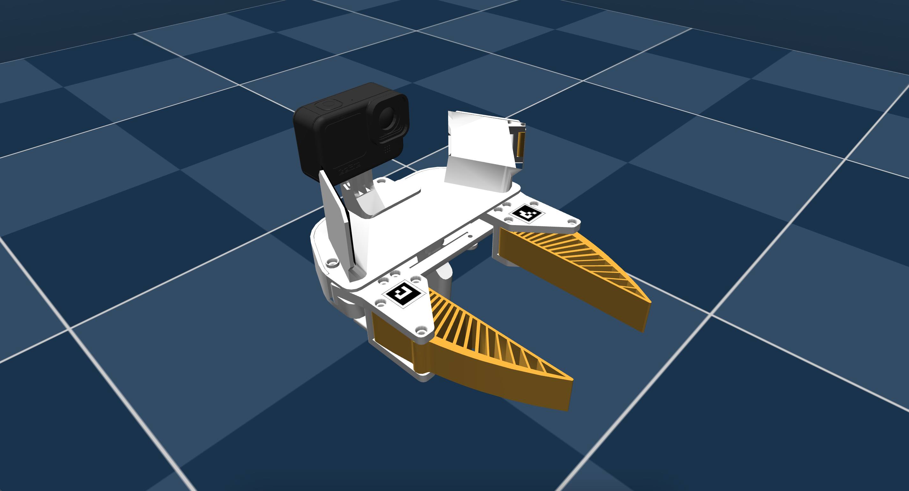 | **umi_gripper** | — | [`umi_gripper.xml`](umi_gripper/umi_gripper.xml) | `MIT` | This package contains a simplified robot description (MJCF) of the Universal Manipulation Interface (UMI) Gripper. It is derived from the publicly available gripper model. |
|  | **unitree_a1** | 4 | [`a1.xml`](unitree_a1/a1.xml) | `BSD-3-Clause` | This package contains a simplified robot description (MJCF) of the A1 Quadruped Robot developed by Unitree Robotics. It is derived from the publicly available URDF description. |
|  | **unitree_g1** | 2 | [`g1.xml`](unitree_g1/g1.xml) | `other/see LICENSE` | This package contains a simplified robot description (MJCF) of the G1 Humanoid Robot developed by Unitree Robotics. It is derived from the publicly available MJCF description. |
|  | **unitree_go1** | 4 | [`go1.xml`](unitree_go1/go1.xml) | `BSD-3-Clause` | This package contains a simplified robot description (MJCF) of the Go1 Quadruped Robot developed by Unitree Robotics. It is derived from the publicly available URDF description. |
| 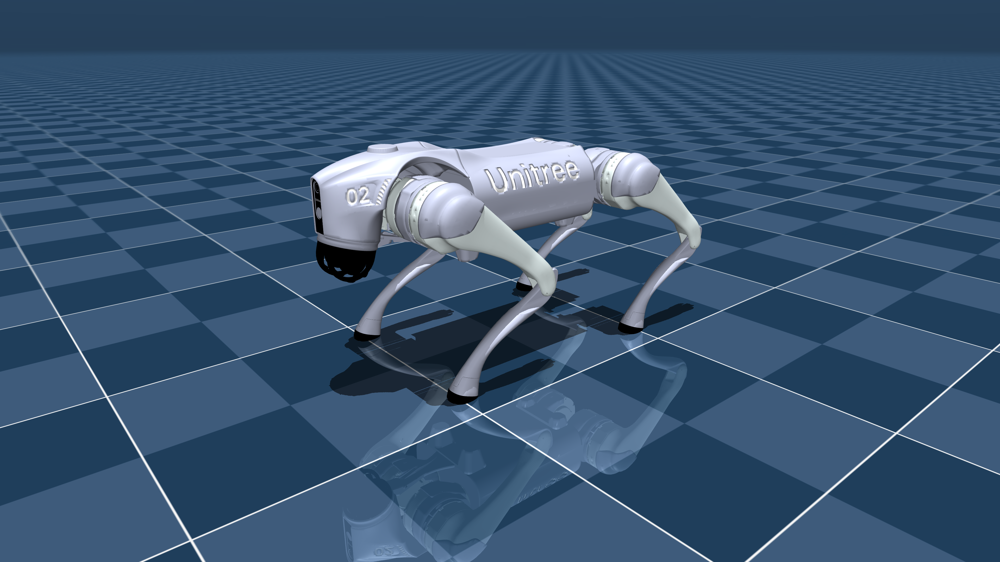 | **unitree_go2** | 4 | [`go2.xml`](unitree_go2/go2.xml) | `other/see LICENSE` | This package contains a simplified robot description (MJCF) of the Go2 Quadruped Robot developed by Unitree Robotics. It is derived from the publicly available URDF description. |
| 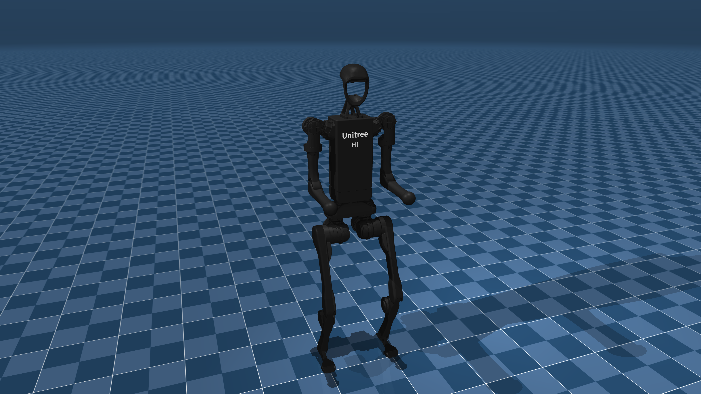 | **unitree_h1** | 2 | [`h1.xml`](unitree_h1/h1.xml) | `other/see LICENSE` | This package contains a simplified robot description (MJCF) of the H1 Humanoid Robot developed by Unitree Robotics. The original URDF and assets were provided directly by Unitree R |
| 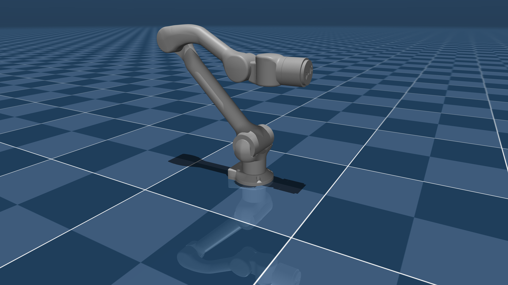 | **unitree_z1** | — | [`z1.xml`](unitree_z1/z1.xml) | `BSD-3-Clause` | This package contains a simplified robot description (MJCF) of the Z1 manipulator developed by Unitree Robotics. It is derived from the publicly available URDF description. |
| 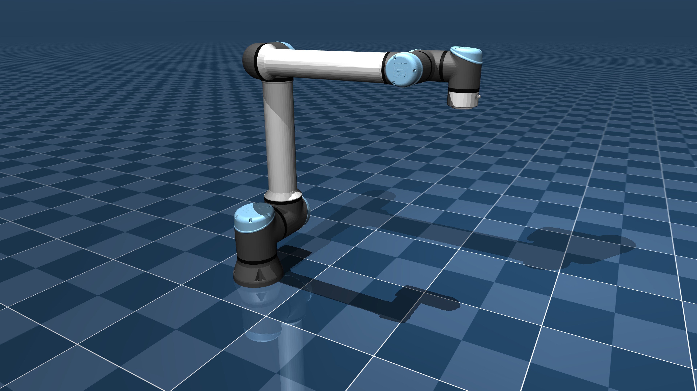 | **universal_robots_ur10e** | — | [`ur10e.xml`](universal_robots_ur10e/ur10e.xml) | `other/see LICENSE` | This package contains a simplified robot description (MJCF) of the UR10e developed by Universal Robots. It is derived from the publicly available URDF description. |
|  | **universal_robots_ur5e** | — | [`ur5e.xml`](universal_robots_ur5e/ur5e.xml) | `other/see LICENSE` | This package contains a simplified robot description (MJCF) of the UR5e developed by Universal Robots. It is derived from the publicly available URDF description. |
|  | **wonik_allegro** | — | [`scene_left.xml`](wonik_allegro/scene_left.xml) | `other/see LICENSE` | This package contains a simplified robot description (MJCF) of the Allegro Hand v3 robot developed by Wonik Robotics, including both right-handed and left-handed versions. |

*68 robots · legs & descriptions are auto-extracted by `robot_studio/catalog_index.py` and may need a manual once-over for pose/cable-driven robots like cassie · controller/estimator/RL notes will be added here later*

---

The upstream MuJoCo Menagerie documentation that used to live here is preserved as
[`MENAGERIE.md`](MENAGERIE.md). [`INDEX.html`](INDEX.html) is the same gallery in
standalone HTML — open it locally in a browser, since GitHub displays HTML files as
source rather than rendering them.
